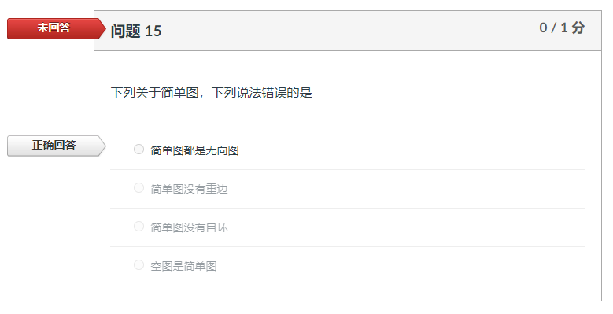

<head>
    
    
</head>
2024年秋离散数学（CS2501）课程网站

* TOC
{:toc}
## 课程通知 / News
- 2024/9/23：图论 第二章课后作业已经发布，截止时间2024年10月13日23:59。
- 2024/10/3：图论第一章和第二章的单元测验题已经发布，截止时间2024年10月13日23:59。**测验题的准确率不计分，仍需要大家完成**。
- 2024/9/23：图论 第一章课后作业已经发布，截止时间2024年9月30日23:59。
- 2024/9/19：欢迎开始**离散数学（CS2501）**的学习！

## 课程材料 / Material

| 章节            | 课件                                                         |
| --------------- | ------------------------------------------------------------ |
| 图论 第一章     | [离散数学-图论-Chapter01](./files/离散数学-图论-Chapter01.pdf) |
| 图论 第二章     | [离散数学-图论-Chapter02](./files/离散数学-图论-Chapter02.pdf) |
| 图论 第三章     | [离散数学-图论-Chapter03](./files/离散数学-图论-Chapter03.pdf) |
| 数理逻辑 第一章 |                                                              |
| 数理逻辑 第二章 |                                                              |
| 数理逻辑 第四章 |                                                              |
| 数理逻辑 第五章 |                                                              |
| 集合论 第九章   |                                                              |
| 集合论 第十章   |                                                              |
| 集合论 第十一章 |                                                              |

## 课后作业 / Exercise

| 章节        | 作业                            |
| ----------- | ------------------------------- |
| 图论 第一章 | P13: 1, 2, 4, 7, 10, 16, 17     |
| 图论 第二章 | P50: 1, 2, 3, 4, 11, 18, 20, 25 |

## 习题课 / 随堂测试 / Exam

### 补充题

- [图论第一章 补充题](./files/离散数学-图论-Chapter01-Exercises.pdf)

### 习题课

### 随堂测试

## 勘误

1. Canvas上的单元复习题：系统在出题的时候任务简单图包含有向图。教材上的定义是简单图为无向图，按照教材定义本题无可选项。**后续以教材上的定义为准**。

